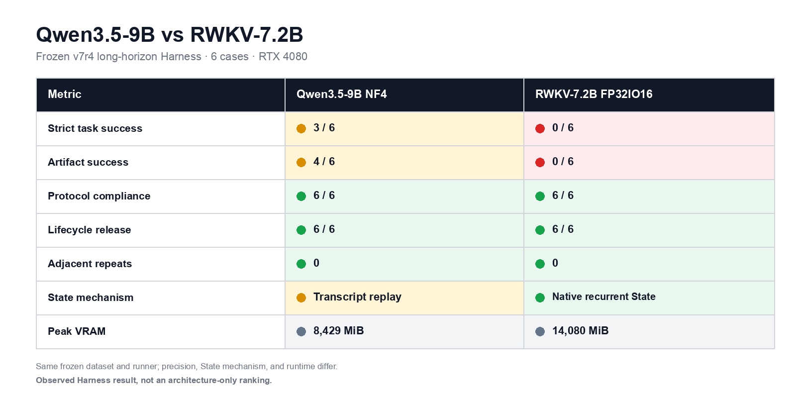
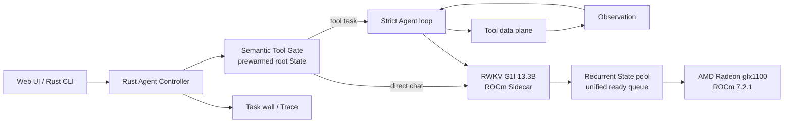

# RWKV State Agent

**A local, state-native Agent runtime for RWKV models**

RWKV State Agent is a fully local, general-purpose Agent built around RWKV recurrent state. It reuses computed context across chat turns, executes strict Tool Calls, and advances many isolated Agent States through one AMD Radeon GPU scheduler.

> **One-line pitch:** a private local Agent that remembers through recurrent state, acts through bounded tools, and can advance 100 isolated jobs on one Radeon GPU without sharing their context.

## Release status

The current public beta is [`v0.3.0-beta.1`](https://github.com/123123213weqw/rwkv-agent/releases/tag/v0.3.0-beta.1). It includes the Rust control plane, local Web UI and CLI, recurrent-State runtime, bounded tools, AMD ROCm configuration, benchmarks, and reviewed evidence summaries.

The architecture and operating contract are documented in [`docs/PROJECT_SPECIFICATION.md`](docs/PROJECT_SPECIFICATION.md).

## What you can verify

- **Ordinary chat:** greetings remain on the direct path and do not call a tool.
- **State-native memory:** the same session reuses its RWKV recurrent state and only computes new turns.
- **Strict Tool Calls:** `run_command`, `knowledge_search`, `long_text_qa`, and optional `web_search` use one bounded call per model turn.
- **Multi-step execution:** Action → Tool → Observation → repair → verification → final answer stays in one owned State.
- **True streaming:** tokens flow from the ROCm Sidecar through the Rust Controller to the Web UI as NDJSON deltas.
- **Independent parallel States:** jobs have separate Owner, State, Session, Workspace, Trace, and release lifecycle.
- **Live task wall:** [`/tasks`](http://127.0.0.1:18120/tasks) shows real Controller runs and their Route, State, Tool count, status, and elapsed time.
- **100-job proof:** 100 independent website tasks completed with physical decode concurrency 32, without shared context or prebuilt answers.

## Frozen long-horizon comparison



The models use the same frozen dataset and runner, but different precision and runtimes, so this is an observed Harness comparison rather than an architecture-only ranking. See the [source CSV](bench/baselines/long_horizon/qwen9-nf4-vs-rwkv7-fp32io16-v7r4.csv) for full result hashes and preserved metrics.

## Architecture



The model never emits a large planner document. Each model turn produces either one strict Tool Call or one final answer. Runtime code owns budgets, state identity, workspace boundaries, validation, metrics, and release.

## Core tools

| Tool | Purpose |
|---|---|
| `run_command` | Controlled file operations, commands, tests, and artifact validation |
| `knowledge_search` | Local long-term knowledge index |
| `long_text_qa` | Evidence-grounded questions over pasted long text |
| `web_search` | Optional retrieval when the user explicitly requests current Web information |

State management, task metrics, artifact verification, and the task wall are runtime features, not model-visible tools.

## AMD Radeon implementation

### Model and runtime

| Component | Verified configuration |
|---|---|
| Model | RWKV-7 G1I Preview4922 13.3B |
| Parameters | 13,269,245,952 |
| Context | 12,288 tokens |
| Decode | Greedy |
| Precision | FP16 |
| GPU | AMD Radeon `gfx1100`, 51,522,830,336 bytes VRAM |
| ROCm | 7.2.1 |
| PyTorch | 2.9.1 ROCm build |
| Backend | RWKV-7 HF native recurrent backend |
| Stable physical batch | 32 |

The source checkpoint is distributed separately by RWKV and is not committed to Git. The verified checkpoint is [RWKV-7 G1I Preview4922 13.3B](https://huggingface.co/BlinkDL/temp-latest-training-models/blob/main/rwkv7-g1i_preview4922-13.3b-20260720-ctx12288.pth). The ROCm conversion used the RWKV HF adapter's AMD branch at commit `7fd669809cefa97c81f8e8cda6c6a59f9cf04635`.

### Inference optimizations

1. **Recurrent session state** — later turns continue from GPU State instead of prefilling the complete transcript.
2. **B1 zero-copy continuation** — one-row decode reuses its cache directly instead of gathering and scattering about 62 MiB of State every token.
3. **Vectorized chunk continuation** — existing recurrent cache can enter the native chunk-prefill path instead of falling back to token-by-token continuation.
4. **Unified ready queue** — prompt chunks and decode rows are scheduled across independent requests up to physical batch 32.
5. **Prewarmed semantic gate root** — static routing instructions are prefetched once; every request forks the root and appends only dynamic input.
6. **Short direct-chat budget** — ordinary chat uses a 96-token ceiling and a visible-answer stop envelope.
7. **End-to-end streaming** — each Greedy update becomes a Sidecar delta and is forwarded directly by Rust; the Web UI does not simulate typing.

## Verified AMD results

### State reuse and ordinary chat

| Measurement | Before | Gate 5 |
|---|---:|---:|
| First-turn wall time | 63.648 s | **8.240 s** |
| Second-turn wall time | 63.784 s | **7.028 s** |
| First-turn speedup | — | **7.72×** |
| Second-turn speedup | — | **9.08×** |
| Second-turn State reuse | no | **yes** |
| Output tokens, first / second | 78 / 97 | **6 / 6** |

B1 streamed and non-streamed continuation produced identical text, token IDs, and stop reason. B1 gather/scatter workspace was zero.

### Independent State scaling

| Resident jobs | Physical batch | Aggregate output throughput |
|---:|---:|---:|
| 1 | 1 | 1.6661 tok/s |
| 4 | 4 | 6.2571 tok/s |
| 8 | 8 | 11.6955 tok/s |
| 16 | 16 | 19.7453 tok/s |
| 32 | 32 | **29.9838 tok/s** |
| 64 | 32 | 25.7295 tok/s |
| 100 | 32 | 24.0266 tok/s |

At B32, concurrent execution was **10.5792×** faster than the same 32 jobs run serially, while all Greedy outputs remained exact. Decode GPU Busy averaged **88%**, peaked at **98%**, and peak VRAM was **37.87 GB**. A same-protocol Gate 5 warm regression measured 29.3472 tok/s, within 2.123% of the frozen baseline.

### 100 independent Agent jobs

- 100 unique prompts, owners, sessions, States, and workspaces;
- physical decode concurrency 32;
- 100/100 valid final artifacts;
- 0 task failures in the frozen final run;
- 0 protocol leaks, context crossovers, or prebuilt answers;
- average / peak GPU Busy: 86.205% / 99%;
- peak VRAM: 48,093,364,224 bytes;
- final waiting, busy, decoding, and State counters: zero.

The correct claim is **“100 independent tasks · physical concurrency 32”**, not “100-way concurrent decode.”

## Quick evaluation path

With the AMD services already configured:

```bash
# Terminal 1 — model Sidecar
rwkv-g1i-sidecar --host 127.0.0.1 --port 18118

# Terminal 2 — Knowledge / Long Text / optional Web data plane
rwkv-agent-data-plane \
  --host 127.0.0.1 \
  --port 18121 \
  --model-urls http://127.0.0.1:18118

# Terminal 3 — Rust Controller and embedded Web UI
./target/release/rwkv-agent-server-rs \
  --host 127.0.0.1 \
  --port 18120 \
  --model-urls http://127.0.0.1:18118 \
  --data-plane-url http://127.0.0.1:18121 \
  --session-dir ./var/sessions \
  --chat-state-capacity 3 \
  --direct-chat-max-tokens 96
```

Open:

- conversation: <http://127.0.0.1:18120/>
- live task wall: <http://127.0.0.1:18120/tasks>
- health: <http://127.0.0.1:18120/health>

Suggested evaluation:

1. Send `你好，只回复你好。` and observe direct streaming with no Tool Call.
2. Send a second message in the same session and inspect `state reused`.
3. Ask the Agent to create a small project, run tests, repair a failure, and verify the result.
4. Paste a long document and ask for an answer with source evidence.
5. Keep `/tasks` open during the runs and inspect live status transitions.
6. Replay the frozen B32 and 100-State benchmarks on the AMD host.

## Install and dependencies

### Required

- Ubuntu 24.04 or another ROCm-compatible Linux distribution;
- ROCm 7.2.1;
- Python 3.10+;
- ROCm PyTorch, Transformers, FastAPI, and Uvicorn;
- Rust 1.97+ for the Controller and CLI;
- RWKV G1I Preview4922 13.3B weights converted to the verified HF native format;
- approximately 48 GB GPU memory for the verified 13.3B / 100-resident-State profile.

### Python environment

Install ROCm PyTorch using the package source appropriate for the target ROCm version, then install the project:

```bash
python3 -m venv .venv
source .venv/bin/activate
python -m pip install --upgrade pip
# Install the official ROCm PyTorch wheel before the project extras.
python -m pip install -e '.[realtime,agent,dev]'
```

### Rust Controller

```bash
cargo build --release --workspace
cargo test --workspace
```

### Radeon Sidecar environment

```bash
export G1I_BACKEND=hf_recurrent
export G1I_HF_MODEL_PATH=/absolute/path/to/preview4922-13.3b/hf-fp16
export G1I_HF_DTYPE=fp16
export G1I_MODEL_ID=rwkv7-g1i-preview4922-13.3b
export G1I_CONTEXT=12288
export G1I_STATE_CAPACITY=132
export G1I_PERSISTENT_STATE_CAPACITY=101
export G1I_MAX_BATCH_SIZE=32
export G1I_PREFILL_CHUNK_SIZE=32
export G1I_BATCH_WINDOW_MS=10
```

Do not commit model weights, private prompts, credentials, `.env` files, or runtime State.

## Repository map

```text
crates/agent-cli/       Rust terminal client
crates/agent-core/      strict Tool protocol, budgets, lifecycle, events
crates/agent-runtime/   sessions, recurrent State, tools, sandbox, research
crates/agent-server/    Rust HTTP Controller, streaming, embedded Web UI
src/rwkv7_scheduler/    ROCm recurrent cache scheduler and State pool
src/rwkv_agent/         Sidecar, data plane, routing, long text, retrieval
demos/                  100-independent-State Agent demonstration
benchmarks/             State scaling, reuse, routing, and Agent regressions
web/                    Claude Code/Codex-inspired local UI and task wall
docs/                   architecture, setup, benchmark, and specification
```

The main development map is [`docs/CODEMAP.md`](docs/CODEMAP.md). Historical CUDA deployment instructions remain in [`docs/QUICKSTART.md`](docs/QUICKSTART.md); the verified Radeon configuration is documented here.

## Privacy and execution boundaries

- Model inference, recurrent State, transcript, workspace, and benchmark artifacts stay on the local host.
- Automatic cross-session preference extraction is intentionally disabled for this release.
- `run_command` is opt-in and restricted to a configured workspace. The verified AMD environment uses an unprivileged user, user/network namespaces, PRoot, bounded output, a timeout, and no unsafe fallback.
- The HTTP Controller has no public authentication. Keep it on loopback, use SSH forwarding, or place it behind an authenticated private gateway.
- Optional `web_search` is the only feature that intentionally uses external network sources.

## Known limitations

- The Radeon path uses the HF native recurrent PyTorch backend; the NVIDIA Albatross MMA extension is not claimed to run on ROCm.
- The 40-case semantic routing set scored 95% with zero missed Tool requests and two false Tool routes.
- The live task wall stores only the latest 100 runs in Controller memory and resets on restart; it is an operational view, not a task database.
- Model weights are external to GitHub and must be converted separately.
- Public authentication, distributed scheduling, and automatic long-term personal memory are outside this release.

## Verification and evidence

The project keeps frozen input hashes, runner hashes, raw JSONL, aggregate metrics, ROCm time series, failure traces, videos, and artifact checksums. Run:

```bash
bash scripts/verify_release.sh
```

Reviewed benchmark summaries and screenshots are available under [`evidence/`](evidence/). Raw traces, private prompts, model assets, and machine-local configuration remain outside the repository. Override `EVIDENCE_ROOT` when validating another environment.

## License

[MIT](LICENSE)
