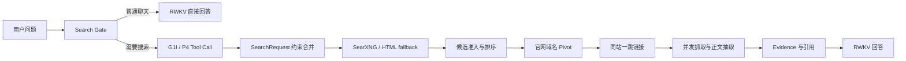

# RWKV Search

面向 RWKV 的本地优先联网搜索与证据问答系统。项目将**是否搜索、搜索词生成、URL 发现、网页抓取、证据选择和回答生成**拆成可单独评测的阶段，避免只凭最终回答主观判断搜索质量。

> 当前状态：研究预览版。截至 2026-07-25，Tool Call、查询形成、实时 URL Discovery、候选准入与
> Rerank、低资源网页抽取、条件反馈搜索以及 FineWiki 长期知识 Benchmark 已经形成可复现链路；优化路径
> 默认关闭，尚未自动替换生产聊天链路。

## 核心设计



- **普通聊天优先**：只有 Search Gate 或用户主动搜索才进入联网链路。
- **RWKV 原生 Tool Call**：G1I 模型以 greedy 解码输出单个严格 `web_search` 调用。
- **确定性约束合并**：模型只负责形成检索表达；时间、来源、`site:` 等硬约束由程序合并。
- **不按行业硬编码**：来源通道表达仓库、论文等显式来源形态，不建立股票、软件、政策分类路由。
- **低资源抓取**：`aiohttp`抓取，Resiliparse快速正文 + Trafilatura轻量元数据；仅在通用低质量信号命中时运行完整Trafilatura兜底，并保留缺少可选依赖时的安全降级。
- **可审计 Benchmark**：同时保存首轮候选、官网 Pivot、一跳扩展、抓取结果、阶段事件和延迟。

## 最新进展（2026-07-25）

### 实时网页检索

增强路径加入了英文查询压缩、召回保护重排、共享 Discovery 缓存、失败归因和空结果安全回退。
同一组 50 条中英文问题的配对结果：

| 指标 | Legacy | Enhanced |
|---|---:|---:|
| Candidate Domain Recall@10 | 30% | **50%** |
| Result Domain Recall@10 | 24% | **40%** |
| 非空结果率 | 72% | **88%** |
| 垃圾结果率 | 9.15% | **1.12%** |
| 抓取成功率 | 56.52% | **71.35%** |
| 平均耗时 | 3291 ms | 3302 ms |

冻结结果见
[`agent-web-recall-5h-v1`](bench/baselines/realtime_retrieval/agent-web-recall-5h-v1/)。
公开搜索引擎在持续负载下仍会超时或触发反爬，因此结果明确记录实际 fallback，不冒充稳定多引擎。

### FineWiki 长期知识检索

本地链路已经完成 `Lexical + E5 Dense + RRF + Cross-Encoder + 段落回填`：

| 测试集 | Lexical Hit@10 | Hybrid Hit@10 | Lexical Recall@10 | Hybrid Recall@10 |
|---|---:|---:|---:|---:|
| MIRACL 中文（393条） | 43.51% | **67.18%** | 28.31% | **47.78%** |
| MIRACL 英文（799条） | 53.69% | **85.11%** | 37.26% | **62.43%** |

桌面 Agent 的 24 条 Shadow A/B 中，Hit@5 从 75.0% 提升到 87.5%，但 Hit@1 没有净提升，
平均延迟约翻倍。因此 Hybrid 和增强 Web 都保持**默认关闭**，不会自动替换可见 `K1..K5` /
`W1..W5`。冻结结果见
[`finewiki-hybrid-v1`](bench/baselines/long_knowledge/finewiki-hybrid-v1/) 和
[`agent-hybrid-shadow-v1`](bench/baselines/long_knowledge/agent-hybrid-shadow-v1/)。

### 已完成

- 严格 G1I/P4 `web_search(query)` Tool Call 与确定性约束合并。
- SearXNG/HTML Discovery、候选准入、官网 Pivot、同站一跳和低资源网页抽取。
- FineWiki 中英文独立索引、页面向量索引、轻量重排和段落回填。
- 可复现的实时检索、长期知识、网页抽取和 Agent Shadow Benchmark。
- 公开仓库只保留代码、测试和脱敏摘要，不包含模型、网页正文、密钥或完整 Trace。

### State-native RWKV Agent

仓库同时包含显式启用的 State-native Agent：一次 Root Prefill 后分叉多个
RWKV recurrent state，执行有界并行检索，再由保留的 Root state 生成带引用回答。
它加入了实体证据准入、结构化 GitHub 资料保留、Claim-to-Evidence 验证和安全拒答，
但不会自动替换普通聊天路径。完整设计、接口和实验结果见
[RWKV Agent](docs/RWKV_AGENT.md) 与
[State-native Agent](docs/STATE_NATIVE_AGENT.md)。

## 快速开始

要求 Python 3.10+。

```bash
git clone https://github.com/123123213weqw/rwkv-search.git
cd rwkv-search
python -m venv .venv
source .venv/bin/activate
pip install -e '.[realtime,dev]'

# 初始化本地索引并启动 Web UI；不加载模型时使用抽取式降级回答
rwkv-search --config configs/default.json init
rwkv-search --config configs/default.json serve --host 127.0.0.1 --port 8765 --no-model
```

打开 <http://127.0.0.1:8765>。

安装 Agent 依赖并查看服务入口：

```bash
pip install -e '.[realtime,agent,dev]'
rwkv-agent-server --help
rwkv-g1i-sidecar --help
```

模型权重和 Albatross runtime 必须通过 `G1I_MODEL_PATH` 与
`G1I_RUNTIME_DIR` 显式配置，仓库不包含这些大文件。

接入 Hugging Face 格式 RWKV：

```bash
rwkv-search --config configs/default.json serve \
  --host 127.0.0.1 --port 8765 \
  --model /path/to/rwkv-hf \
  --model-label RWKV \
  --device cuda:0 --dtype fp16
```

完整安装、SearXNG 和 G1I/P4 用法见 [使用指南](docs/USAGE.md)。

## 运行 Benchmark

```bash
# Schema、指标与离线测试
PYTHONPATH=src python -m unittest discover -s tests

# 先跑少量联网 Smoke
PYTHONPATH=src python bench/run_realtime_retrieval_bench.py \
  --config configs/benchmark.json \
  --case-id retrieval-zh-001 \
  --case-id retrieval-en-006

# 全部 50 条
PYTHONPATH=src python bench/run_realtime_retrieval_bench.py \
  --config configs/benchmark.json

# 本地长期知识检索（FineWiki × MIRACL，中英文人工 qrels）
PYTHONPATH=src:. python -m bench.run_long_knowledge_bench \
  --cases bench/external/miracl-v1/miracl_long_knowledge_dev_v1.jsonl \
  --index rwkv-finewiki-zh-full-v1 --language zh \
  --output bench/runs/long-knowledge-zh.jsonl \
  --summary bench/runs/long-knowledge-zh-summary.json
```

较小的项目回归集可将`--cases`替换为`bench/long_knowledge_compat_v1/cases.jsonl`，并选择对应的
语言和索引。

运行产物写入被 Git 忽略的 `bench/runs/`。只有经过人工复核、记录环境和配置的汇总才进入 `bench/baselines/`。

## 仓库结构

```text
src/rwkv_search/    聊天、RWKV、实时检索和本地检索实现
src/rwkv_agent/     Agent Controller、State research、工具与 HTTP 服务
src/rwkv7_scheduler/ RWKV state pool 与连续批处理调度器
cli/                Agent Rust 终端客户端
benchmarks/         Agent 专用 Benchmark runner 与小型固定输入
bench/              公开测试集、Runner、指标与冻结摘要
configs/            通用配置和 Benchmark 配置
contracts/          前后端事件与来源契约
deploy/searxng/     本地 SearXNG 示例
docs/               架构、使用、Benchmark 和里程碑
tests/              单元与回归测试
```

## 文档

- [架构](docs/ARCHITECTURE.md)
- [使用指南](docs/USAGE.md)
- [Benchmark 方法](docs/BENCHMARK.md)
- [长期知识语料与Benchmark](docs/LONG_KNOWLEDGE_BENCHMARK.md)
- [优化里程碑](docs/MILESTONES.md)
- [贡献指南](CONTRIBUTING.md)

## 已知限制

- 当前实时搜索的最大瓶颈是搜索引擎没有发现精确目标URL；Tool Call序列化和静态正文抽取已不是首要瓶颈。
- 页面级Dense Retriever与Rerank只接入桌面Agent的默认关闭Shadow，尚未接入生产；Top-1回归、
  约2倍延迟及只有7条缺失探针的准入校准仍未解决。
- SearXNG 的结果质量取决于可用搜索引擎和网络出口。
- `configs/default.json` 中候选增强能力默认关闭；请先使用 Benchmark 或 Shadow 验证再启用。
- 仓库不包含 RWKV 权重、第三方搜索 API 密钥、抓取正文、私有服务器配置或完整调试 Trace。

## License

[MIT](LICENSE)
