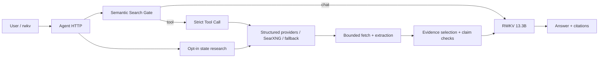

# RWKV Agent

Local-first RWKV chat, tool use, Web research and evidence-grounded answers.

- **Current release:** `v0.3.0-beta.1`
- **Primary interface:** `rwkv` terminal client + RWKV Agent HTTP backend
- **Verified model:** RWKV-7 G1I Preview4922 13.3B, context 12,288

RWKV Agent keeps ordinary chat fast and enters retrieval only when the user
explicitly requests search or the semantic Search Gate selects a tool. Search,
URL discovery, page extraction, Evidence selection and answer generation remain
separate and auditable stages.

**RWKV Agent** is the user-facing product. **RWKV Search** is its internal
retrieval subsystem. The repository and Python package retain the `rwkv-search`
compatibility name in this Beta.

> This Beta is suitable for local use and controlled internal deployment. The
> HTTP service has no public authentication or rate limiting; keep it on
> loopback or behind your own authenticated gateway.

## What works

- ordinary multi-turn RWKV chat;
- strict greedy `web_search`, `knowledge_search` and `long_text_qa` Tool Calls;
- self-hosted SearXNG with independent Dogpile and Naver lanes, plus GitHub,
  MediaWiki and Crossref discovery, with bounded Bing fallback and optional Tavily;
- confidence-scheduled bounded fetching, low-resource static extraction,
  structured-API Evidence reuse, strictly gated excerpt fallback and
  evidence-based answers;
- deletion-only query guarding that removes model-invented dates or versions
  while preserving useful entity, translation and source wording;
- explicit B1-B4, one-to-three-round state-native Web research;
- session transcript, pasted long-text QA, citations and safe abstention;
- reproducible retrieval and 200-case Agent regression benchmarks.

The older `rwkv-search` Web UI remains available as a **Legacy Web Preview**.
It does not yet expose every capability of the current Agent backend and is not
the recommended first-run experience.

## Five-minute setup

There are two installation modes:

- **Client only:** install the small Rust terminal client on macOS or Linux and
  connect it to an existing Agent Controller over loopback, SSH forwarding or a
  private network. See the [CLI guide](cli/README.md).
- **Full self-hosted Beta:** install the Python backend, model runtime and CLI on
  a Linux CUDA host using the steps below.

The Controller is not a hosted public API. It has no built-in authentication or
rate limiting, so the supported remote-client pattern is an SSH tunnel or an
authenticated private gateway rather than exposing port 8120 directly.

### Client-only install

```bash
git clone https://github.com/123123213weqw/rwkv-search.git
cd rwkv-search
./cli/install.sh --client-only

ssh -N -L 8120:127.0.0.1:8120 user@gpu-host
RWKV_AGENT_ENDPOINT=http://127.0.0.1:8120 rwkv-agent
```

Tagged Beta releases can also attach prebuilt Apple Silicon macOS and x86-64
Linux CLI archives with adjacent SHA-256 files.

### 1. Full self-hosted install

Requirements: Linux CUDA host, Python 3.10+, Rust toolchain, `curl`, an RWKV G1I
checkpoint and a compatible Albatross runtime.

```bash
git clone https://github.com/123123213weqw/rwkv-search.git
cd rwkv-search

python -m venv .venv
source .venv/bin/activate
pip install -e '.[realtime,agent]'

cd cli
./install.sh
cd ..
```

### 2. Configure the model

```bash
rwkv-agent-service init
$EDITOR ~/.config/rwkv-agent/rwkv-agent.env
rwkv-agent-service doctor
```

Set absolute values for `RWKV_AGENT_PROJECT_ROOT`, `RWKV_AGENT_PYTHON`,
`G1I_MODEL_PATH` and `G1I_RUNTIME_DIR`. The complete template is
[`.env.example`](.env.example). Model and runtime details are in
[Model setup](docs/MODEL_SETUP.md).

### 3. Start and chat

```bash
rwkv
```

The `rwkv` launcher checks the local Controller, starts the configured RWKV
model backend when needed, and opens an interactive conversation.

Useful commands:

```bash
rwkv ask "你好"
rwkv tool web-search "Python latest stable release"
rwkv research --branches 4 --rounds 2 \
  "Who created RWKV and what did the official repositories update recently?"
```

Administrator commands:

```bash
rwkv-agent-service status
rwkv-agent-service logs
rwkv-agent-service stop
```

See [Quickstart](docs/QUICKSTART.md) for SearXNG, remote GPU hosts and failure
recovery.

## Architecture



The model produces a small tool request, not a large Planner JSON document.
Time, source and explicit-site constraints are merged deterministically. The
retrieval path uses general source/page features rather than topic-specific
finance, software or policy routers. Cached Evidence does not consume the
network-fetch budget; live candidates are scheduled by admission confidence,
and up to four final pages from one source domain may coexist when relevant.
When an origin is blocked or its fetched shell contains no extractable body, a
high-confidence, entity-matched search excerpt can be retained as explicitly
labeled limited evidence without another network request.

## Verified quality

This remains a Beta. A later time-isolated Fresh-Web-200-v1 blind run had 100%
request success and 81% Gold-domain recall, but only 16.75% exact-URL recall,
58.5% citation presence, 11.19% answer Token F1 and 42.33-second P95 latency.
It therefore failed the current Fresh-Web release gate. The CLI and retrieval
stack are usable for testing, but the project does not claim production-grade
open-Web answer quality yet.

The current 13.3B stack was evaluated on 200 fixed cases: 40 each from BFCL,
WebWalkerQA, FRAMES, LongBench v2 and ALCE.

| Metric | 7.2B P0 | 13.3B P0 |
|---|---:|---:|
| BFCL official AST | 67.5% | **87.5%** |
| BFCL Tool Call exact | 45.0% | **57.5%** |
| FRAMES answer F1 | 1.00% | **10.90%** |
| FRAMES domain recall | 0% | **57.5%** |
| FRAMES exact-page recall | 0% | **14.79%** |
| LongBench v2 choice accuracy | 25.0% | **27.5%** |
| ALCE citation exact-page recall | 35.5% | 35.5% |

The run had no HTTP 409, route, state-leak or budget-overrun failures. It also
found three malformed BFCL Tool Calls, weak WebWalker coverage and increased
unsupported claims on answered FRAMES cases. These are tracked explicitly in
[Known issues](docs/KNOWN_ISSUES.md); this table is not a claim of
Doubao/DeepSeek-level search quality.

Machine-readable summaries:

- [`e2e-p0-13b-preview4922-summary.json`](bench/baselines/agent-unified-regression-v1/e2e-p0-13b-preview4922-summary.json)
- [`e2e-p0-13b-vs-7b-comparison.json`](bench/baselines/agent-unified-regression-v1/e2e-p0-13b-vs-7b-comparison.json)
- [`public-results-manifest.json`](bench/baselines/agent-unified-regression-v1/public-results-manifest.json)

## Repository layout

```text
src/rwkv_agent/       Current Agent Controller, tools and Sidecar
src/rwkv_runtime/     Shared decode, classification and scheduler contracts
src/rwkv7_scheduler/  Recurrent state pool and unified mixed-row scheduling
src/rwkv_search/      RWKV Search retrieval subsystem and Legacy Web Preview
cli/                  Rust terminal client and local service lifecycle
configs/              Default, production example and benchmark configs
deploy/               Agent host and optional SearXNG examples
contracts/            Chat, Evidence, source and error schemas
benchmarks/            Agent evaluation runners
bench/baselines/      Reviewed, publishable benchmark summaries
docs/                 User, architecture and development documentation
tests/                Unit and regression tests
```

## Documentation

- [Quickstart](docs/QUICKSTART.md)
- [Model setup](docs/MODEL_SETUP.md)
- [Local knowledge service](docs/KNOWLEDGE_SETUP.md)
- [Deployment](docs/DEPLOYMENT.md)
- [Configuration](docs/CONFIGURATION.md)
- [Troubleshooting](docs/TROUBLESHOOTING.md)
- [Known issues and optimization backlog](docs/KNOWN_ISSUES.md)
- [Release checklist](docs/RELEASE.md)
- [Architecture](docs/ARCHITECTURE.md)
- [Benchmark method](docs/AGENT_BENCHMARK.md)
- [Contributing](CONTRIBUTING.md)
- [Security](SECURITY.md)

## Data and privacy

The repository does not include model weights, API keys, crawled page bodies,
private server configuration, complete token traces or license-restricted
benchmark cases. Runtime state belongs under the configured state directory and
is ignored by Git.

## License

[MIT](LICENSE)
