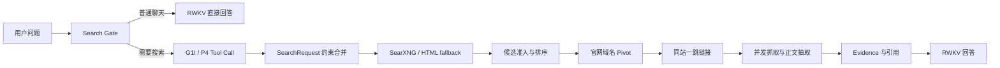

# RWKV Search

面向 RWKV 的本地优先联网搜索与证据问答系统。项目将**是否搜索、搜索词生成、URL 发现、网页抓取、证据选择和回答生成**拆成可单独评测的阶段，避免只凭最终回答主观判断搜索质量。

> 当前状态：研究预览版。实时检索 Benchmark、G1I/P4 Tool Call、候选过滤和精确 URL 发现已经可复现；优化路径默认关闭，尚未自动替换生产聊天链路。

## 核心设计



- **普通聊天优先**：只有 Search Gate 或用户主动搜索才进入联网链路。
- **RWKV 原生 Tool Call**：G1I 模型以 greedy 解码输出单个严格 `web_search` 调用。
- **确定性约束合并**：模型只负责形成检索表达；时间、来源、`site:` 等硬约束由程序合并。
- **不按行业硬编码**：来源通道表达仓库、论文等显式来源形态，不建立股票、软件、政策分类路由。
- **低资源抓取**：`aiohttp + selectolax + Trafilatura` 静态快速路径，有限并发、响应体上限和 SSRF 防护。
- **可审计 Benchmark**：同时保存首轮候选、官网 Pivot、一跳扩展、抓取结果、阶段事件和延迟。

## 当前效果

同一组 50 条中英文实时检索问题、同一实验主机和冻结 P4 查询的配对结果：

| 指标 | 基线 | 精确发现 | 变化 |
|---|---:|---:|---:|
| Candidate Domain Recall@10 | 42% | **48%** | +6pp |
| Candidate Target Page Recall@20 | 6% | **12%** | +6pp |
| Result Domain Recall@10 | 20% | **32%** | +12pp |
| 非空结果率 | 56% | **68%** | +12pp |
| 垃圾结果率 | 1.11% | **0.97%** | -0.14pp |
| 抓取成功率 | 44.01% | **53.95%** | +9.94pp |
| 平均耗时 | 4263 ms | 5067 ms | +803 ms |
| P95 | 8010 ms | 8010 ms | 基本不变 |

搜索上游会波动，因此跨运行差值只作为观测；Pivot 与一跳扩展的算法贡献以同一次运行的 `initial → post_pivot → final` 阶段指标为准。详细方法见 [Benchmark 文档](docs/BENCHMARK.md)。

## 快速开始

要求 Python 3.10+。

```bash
git clone https://github.com/123123213weqw/rwkv-search.git
cd rwkv-search
python -m venv .venv
source .venv/bin/activate
pip install -e '.[realtime,dev]'

# 初始化本地索引并启动 Web UI；不加载模型时使用抽取式降级回答
rwkv-search --config configs/default.json init
rwkv-search --config configs/default.json serve --host 127.0.0.1 --port 8765 --no-model
```

打开 <http://127.0.0.1:8765>。

接入 Hugging Face 格式 RWKV：

```bash
rwkv-search --config configs/default.json serve \
  --host 127.0.0.1 --port 8765 \
  --model /path/to/rwkv-hf \
  --model-label RWKV \
  --device cuda:0 --dtype fp16
```

完整安装、SearXNG 和 G1I/P4 用法见 [使用指南](docs/USAGE.md)。

## 运行 Benchmark

```bash
# Schema、指标与离线测试
PYTHONPATH=src python -m unittest discover -s tests

# 先跑少量联网 Smoke
PYTHONPATH=src python bench/run_realtime_retrieval_bench.py \
  --config configs/benchmark.json \
  --case-id retrieval-zh-001 \
  --case-id retrieval-en-006

# 全部 50 条
PYTHONPATH=src python bench/run_realtime_retrieval_bench.py \
  --config configs/benchmark.json
```

运行产物写入被 Git 忽略的 `bench/runs/`。只有经过人工复核、记录环境和配置的汇总才进入 `bench/baselines/`。

## 仓库结构

```text
src/rwkv_search/    聊天、RWKV、实时检索和本地检索实现
bench/              公开测试集、Runner、指标与冻结摘要
configs/            通用配置和 Benchmark 配置
contracts/          前后端事件与来源契约
deploy/searxng/     本地 SearXNG 示例
docs/               架构、使用、Benchmark 和里程碑
tests/              单元与回归测试
```

## 文档

- [架构](docs/ARCHITECTURE.md)
- [使用指南](docs/USAGE.md)
- [Benchmark 方法](docs/BENCHMARK.md)
- [优化里程碑](docs/MILESTONES.md)
- [贡献指南](CONTRIBUTING.md)

## 已知限制

- 当前最大瓶颈是目标页面抓取和正文抽取，不是 Tool Call 序列化。
- SearXNG 的结果质量取决于可用搜索引擎和网络出口。
- `configs/default.json` 中候选增强能力默认关闭；请先使用 Benchmark 或 Shadow 验证再启用。
- 仓库不包含 RWKV 权重、第三方搜索 API 密钥、抓取正文、私有服务器配置或完整调试 Trace。

## License

[MIT](LICENSE)
