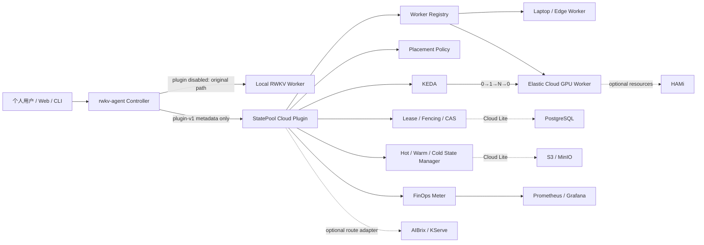

# 一页架构与技术边界

## 数据边界

Placement 请求只传 Session/Owner 标识、隐私级别、StateReference、精确模型
身份、估算 token、SLO、区域和成本上限；不传 Prompt、Transcript、凭据或原始
State。原始 State 只进入明确启用的 StateStore 路径。

## 失败语义

- 未启动远程操作：可按配置安全回退本地；
- 已获得 Lease：禁止并行本地重放；
- 远程结果不确定：等待 Lease/版本协调，不能猜测执行失败；
- Lease 过期后旧 holder 即使恢复，也因更小 fencing token 无法提交；
- 模型身份不兼容：丢弃原始 State，走 Context Capsule/transcript re-prefill。

## 不造的轮子

| 能力 | 采用上游 |
|---|---|
| Pod/GPU 生命周期 | Kubernetes |
| 事件驱动扩缩容 | KEDA |
| GPU 分片/异构资源 | HAMi（可选） |
| 网关/通用推理平台 | AIBrix/KServe（可选） |
| 元数据事务 | PostgreSQL |
| Cold 对象 | S3/MinIO |
| 时序与可视化 | Prometheus/Grafana |

项目只维护 State-aware glue 和可验证契约。
