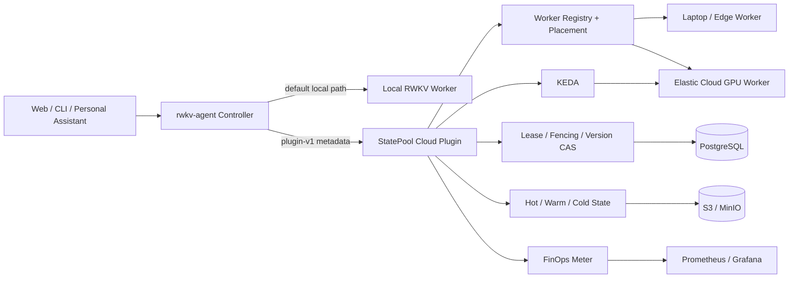

# RWKV State Agent：面向长期个人助手的云原生有状态 Serverless 推理

## 摘要

个人 AI 助手具有一个与普通无状态聊天不同的矛盾：用户希望助手长期在线、
持续保有上下文，但请求通常稀疏且有长空闲期。把每个 Session 固定在 GPU
Worker 上可以保留计算状态，却会让 GPU 随用户一起等待；请求后立即释放 GPU
可以缩容到零，却需要在下次唤醒时重新 Prefill 全部历史。

RWKV State Agent 在现有本地优先个人助手上增加一个默认关闭、进程外的
StatePool Cloud Plugin。它把 RWKV recurrent State 定义为 owner-scoped、
版本化、可校验、可分层存储的云原生对象，通过精确 State ABI、Lease、
fencing token、不可变 Snapshot、版本 CAS 和安全 Drain，使助手 State 能在
GPU Worker 生命周期之外继续存在。本项目复用 Kubernetes、KEDA、
PostgreSQL、S3/MinIO、Prometheus/Grafana，并预留 HAMi、AIBrix/KServe
适配，不复制上游源码、不维护上游 Fork。

统一叙事是：**助手常驻，但 GPU 不必常驻；每个人长期拥有一个 AI 助手，而
不需要长期占用一张 GPU。**

## 1. 为什么是 RWKV

RWKV 的历史路线不是简单地把 Transformer 换一个名字，而是尝试同时保留
并行训练和 RNN 形式自回归推理。对本项目而言，关键不是模型榜单，而是推理
时存在一个随 token 更新、大小不随完整历史线性增长的 recurrent State。

这带来五个工程属性：

1. 同一 Session 的下一轮可以从已有 State 继续，只计算新增输入；
2. 多个用户拥有隔离 State，不需要合并上下文；
3. 本地电脑可以长期保存隐私 Transcript、凭据和策略；
4. 稳定系统前缀可以预计算并 Fork，降低重复准备成本；
5. State 可以独立于模型权重被 Snapshot、Restore、分层、计量和调度。

RWKV 并不会自动解决分布式一致性。原始 State 也不能跨模型随意转换。因此
StatePool 只允许 `model_id + immutable revision + tokenizer + state_abi`
完全相同时迁移原始 State；不兼容时必须显式走 Context Capsule 或
Transcript re-prefill。

## 2. 用户场景与市场切口

最适合的场景同时满足四个条件：同一用户反复返回、历史计算值得保留、流量有
明显空闲或突发、隐私/SLO/成本会影响本地或云端选址。包括：

- 编程、研究和知识助手；
- 周期性工作的运营 Agent；
- 多租户个人助手托管；
- 企业私有知识伴侣；
- 本地常驻、云端突发的边云助手。

项目不以“又一个通用 AI 平台”为切口，而以可以被验证的三个指标成交：减少
GPU 空闲分钟、减少重复 Prefill、缩短故障后的 Session 恢复路径。

## 3. 架构

### 3.1 不破坏原项目

插件默认 `enabled=false`。关闭时不构造插件 HTTP Client，不请求云端端口，
原 API、CLI、Web UI、Sidecar、SQLite、本地 State affinity、工具调用和推理
路径保持原行为。插件只通过版本化 HTTP/Unix Socket 边界接入，不使用不稳定
Rust 动态库 ABI。

### 3.2 数据边界

Placement 只接收 Session/Owner ID、隐私级别、精确模型身份、StateReference、
估算 token、SLO、区域和成本上限，不接收 Prompt、Transcript、凭据或原始
State bytes。`local_only` 不允许进入云 Worker；原始 State 只进入明确启用的
生命周期路径。

### 3.3 本地电脑 + 云

本地电脑是隐私根和可选 Edge Worker：保存可审计 Transcript、身份、凭据和
低成本常驻能力。云端提供可弹性回收的兼容 GPU Worker。Placement 基于隐私、
State 所在层级、队列、SLO、恢复代价、价格和区域选择执行位置。云端不是把
本地助手整体搬走，而是按策略接管一次重任务或突发请求。

## 4. 核心技术创新

### 4.1 Stateful Inference Session ABI

`StateReference` 记录 Session、Owner、版本、fencing token、provider mode、
精确 `ModelRef`、Hot/Warm/Cold placement、对象 URI、SHA-256、大小、原子提交
标志和时间。State 是一等协议对象，而不是某个 Pod 内不可见的缓存。

### 4.2 单写 Lease、fencing 与 CAS

同一 `(session_id, owner_id, expected_version)` 同时只有一个 writer Lease。
每次新 Lease 获得更大的 fencing token；旧进程即使网络恢复也不能晚提交。
Snapshot 先写不可变对象、重算 checksum，再用 expected version 做 CAS。
这同时约束并发覆盖、过期 Worker 复活和提交状态不确定时的双执行。

### 4.3 Hot / Warm / Cold

- Hot：State 位于兼容 GPU Worker，可直接 continue；
- Warm：State 位于主机内存，恢复成本较低；
- Cold：State 位于 S3 兼容对象存储，可跨 Worker 生命周期恢复；
- incompatible：不得伪迁移，走 Capsule 或 transcript re-prefill。

Placement 评分同时考虑 State affinity、恢复层级、Worker queue/running、区域、
SLO 和 GPU-hour price，并返回可解释 `reason_code`。

### 4.4 安全缩容

Worker Drain 先停止新 inference/prefill/restore 请求，保留 snapshot/release
维护入口。只有 active requests 为 0，且除可重建系统 root 外的 dirty user
State 明确为 0，preStop 才返回 `safe_to_stop`。字段缺失被视为 unknown，而
不是乐观地当作 0。

### 4.5 State-aware FinOps

插件公开 Worker readiness、pending requests、estimated decode backlog、
GPU seconds、State I/O、snapshot/restore、Hot/Warm/Cold hit、避免的 Prefill、
local/edge/cloud 请求和分币种 estimated cost。实际观测、估算值和 placement
决策计数在指标定义中分开，不把 estimated queue/cost 写成真实账单。

## 5. 复用上游，而不是造轮子

| 需求 | 上游职责 | 本项目只维护 |
|---|---|---|
| Pod 与 GPU 生命周期 | Kubernetes | Worker/State 安全条件 |
| 0↔1 与 1↔N | KEDA/HPA | State-aware demand metrics |
| GPU 分片与异构资源 | HAMi（可选） | values/annotation 适配 |
| 网关与通用 Serving | AIBrix/KServe（可选） | State affinity metadata |
| 事务元数据 | PostgreSQL | Lease/fencing/CAS schema |
| Cold 对象 | S3/MinIO | immutable State key/checksum |
| 时序与看板 | Prometheus/Grafana | State/FinOps domain metrics |

第三方组件以镜像、标准协议、Adapter、Chart values、Dashboard 和固定兼容矩阵
接入。主仓库不 vendor Kubernetes/KEDA/HAMi/AIBrix 等源代码，也不建立必须
长期追随上游 main 的 Fork。

## 6. 实现与部署 Profile

1. **Local：**原助手 + 本地 Worker；插件关闭，零云依赖。
2. **Cloud development：**StatePool + LocalFS/in-memory，验证协议和失败语义。
3. **Cloud Lite：**PostgreSQL Lease/CAS + S3/MinIO Cold State。
4. **Kubernetes：**Helm Controller/Worker、readiness/liveness、preStop、KEDA、
   ServiceMonitor、Grafana Dashboard。
5. **Cloud Full（可选）：**外接 HAMi、AIBrix/KServe，不作为启动前置条件。

## 7. 证据

### 7.1 默认兼容和一致性

插件关闭回归、握手/降级、exact-model Placement、Lease conflict、stale
fencing、CAS、checksum、uncertain commit fail-closed、Controller
acquire→continue→snapshot→commit→release→restore 全部有自动测试。Rust 只在
远程批准环境执行，完整 Workspace 结果随 RTX 4080 产物归档。

### 7.2 RTX 4080 Worker 强杀恢复（实测）

RWKV-7 G1I 1.5B Worker 生成并提交 12,911,277-byte State；源 PID 被杀死；fresh
兼容进程从 PostgreSQL/S3 恢复为新的 GPU State ID，并将 seen tokens 从 42
推进到 66。Worker-local snapshot 81.266 ms、restore 104.246 ms，preStop 返回
0 active/0 dirty。该实验是同一物理 RTX 4080 上的 sequential process，不是
跨节点 GPU 迁移。SSH 隧道下的 S3 读写时间只证明字节正确，不能作为 SLO。

### 7.3 KEDA 0→1→3→0（控制面实测）

kind 0.30.0、Kubernetes 1.34.0、KEDA 2.20.1、Prometheus 3.11.3 上，三个
plan miss 把 pending 置 3：3.234 秒到第一个 desired replica，7.017 秒到
desired=3，14.380 秒到 Ready=3，最终 desired 和 Pod 都回到 0。三个 Pod 的
preStop 均与控制面一致返回 safe。Worker 是非 GPU 协议仿真，因此不宣称模型
吞吐或 GPU Pod SLO。

### 7.4 100 Session A/B/C（仿真回放）

固定 100 Session、每 Worker 8 Session、两段 60 秒活跃和 300 秒空闲，引用
上述 KEDA 时间、RTX 4080 State 大小和冻结 contract correctness：

| 方案 | modeled GPU-hours/100 | idle GPU-min | repeated Prefill | estimated CNY |
|---|---:|---:|---:|---:|
| Sticky | 1.516667 | 65.0000 | 0 | 3.033333 |
| Stateless | 0.831877 | 17.6813 | 51,200 | 1.663754 |
| StatePool | 0.831877 | 17.6813 | 0 | 1.663754 |

StatePool 相比 Sticky 减少 45.151% modeled GPU-hours，相比 Stateless 避免
51,200 Prefill tokens，并交换 3,873,383,100 State transfer bytes。它是公式
透明的 `simulation_replay`，不是 live GPU utilization benchmark；Stateless
Prefill 的 GPU 时间未知，因此没有被虚构进成本优势。

## 8. 开源治理与长期维护

主仓库采用 MIT；第三方许可证和接入形态进入
`third_party/COMPONENTS.yaml`、NOTICE 和 CycloneDX SBOM。协议变更需要 ADR、
Schema/OpenAPI/example、迁移说明和公开评审窗口。项目维护面限定在 State
contract、Placement、Lifecycle、FinOps 和薄 Adapter；上游系统独立升级，
每个验证版本写入 `COMPATIBILITY.md`。

治理采用 maintainer-led 结构，不虚构组织规模。Issue/PR 模板、贡献指南、
安全报告、兼容窗口、Release Checklist 和 evidence gate 均已进入仓库。

## 9. 当前边界与下一步

当前仍不宣称：跨模型原始 State 迁移、真实 GPU Kubernetes 0→1→N→0、生产
级多租户认证、Controller restart 自动重建 StateReference 索引、生产 restore
P95、同拓扑 live A/B/C GPU utilization。下一步优先把已经独立验证的数据面和
控制面装入一个发布 GPU Worker 镜像，而不是扩展更多上游 Fork。

## 结论

底层调度系统解决“把哪张卡分给哪个 Pod”，通用推理平台解决“把哪个请求发给
哪个实例”。StatePool 补的是两者之间缺失的一层：当长期个人 Agent 的 GPU
Pod 消失时，谁拥有它的计算 State、哪个版本有效、何时可以安全回收、恢复
成本如何进入调度与计费。

这使云不再只是远程运行模型，而成为本地优先个人助手的弹性计算层：
**State 长期属于用户，GPU 只在需要时出现。**
