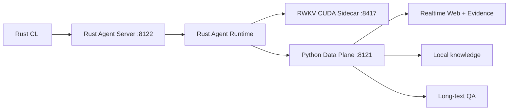

# 架构

## Rust 控制面与 Python 数据面

当前代码提供两套兼容 Controller：原 Python Controller，以及默认监听
`8122` 的 Rust-first Controller。Rust 路径已完整覆盖 CLI 所需的 Gate、普通
聊天、严格 Tool/Observation 循环、跨轮 Recurrent State、并行 State Research、
Session transcript 和 State 释放；Python 不再承担这条路径的 Agent 状态机。

边界是刻意冻结的：

- Rust 持有请求预算、工具注册表、严格协议、Session 锁、State ID/Owner、LRU、
  Fork/Batch Continue、取消与所有成功/失败路径的 Release；
- Python 数据面只持有 `web_search`、`knowledge_search`、`long_text_qa`、
  Query Coordination、Evidence Reduce/Admission 和 Claim Validation；
- CUDA/Torch、模型权重、Crawler、索引和语义模型不迁移到 Rust；
- Session transcript 是唯一持久记忆，不做隐式用户画像提取；粘贴长文本按
  Session 暂存于数据面；
- `run_command(command)`默认关闭，仅在 Linux + Bubblewrap + 显式 Workspace
  条件同时满足时出现，且没有非隔离后备路径。

Rust Server与旧API保持`/health`、`/v1/agent/run`、
`/v1/agent/run_stateful`、`/v1/agent/gate`、`/v1/tools/call`兼容。
在单独授权切换前，公共`8120`仍由旧Python Controller持有；Rust默认端口
`8122`只用于隔离/Shadow验证。

活跃Rust源码在仓库根目录`crates/`；`cli/`只保留客户端安装、打包、服务生命周期和
集成Smoke脚本。详细文件所属见[`CODEMAP.md`](CODEMAP.md)。

## 两条路径

### 普通聊天路径

用户问题经过轻量 Search Gate。无需实时信息时，直接交给 RWKV，不注入“正在搜索”等前置提示，也不要求模型输出 JSON。

### 搜索路径

1. **G1I/P4**：greedy 解码生成一个 `web_search` Tool Call。
2. **严格解析**：只接受一个标签完整、JSON 合法、工具名正确、参数只有 `query` 的调用。
3. **SearchRequest**：把原问题中的时间、来源和显式 `site:` 约束确定性合并回模型查询。
4. **Discovery**：优先使用本地 SearXNG JSON；不可用时可退到轻量 HTML Discovery。
5. **候选准入**：按标题、URL、摘要、实体覆盖、来源约束、RRF 和域名多样性排序并过滤垃圾页。
6. **精确发现**：显式仓库/论文请求可增加来源通道；从首轮结果推导最多两个官网域名并做一次 Pivot；对已抓取官网页面最多扩展八条同组织链接。
7. **抓取与抽取**：共享 `aiohttp` Session；限制并发、重定向和响应大小；HTML默认使用Resiliparse快速正文和Trafilatura轻量元数据，只在通用低质量信号命中时运行完整Trafilatura兜底，缺依赖时回退原抽取实现。
8. **Evidence**：保留来源、发布时间、抓取时间和引用 ID，再交给 RWKV 生成答案。

## 为什么不让模型输出复杂 Planner JSON

RWKV 只生成最关键、最适合模型表达的搜索词。是否最新、要求官网、显式站点、抓取预算等由代码从原问题和配置中确定，减少格式错误、延迟和不可解释路由。

## 资源边界

- 默认一个普通 Discovery 请求。
- 最多两个来源通道。
- 最多两个官网域名、一次 Pivot。
- 最多八条一跳链接，不递归。
- Fast 模式默认最多抓取八页、八秒。
- 搜索页与正文只进入短 TTL 内存缓存，不写本地知识库。

## 运行状态

精确发现功能由配置开关控制并默认关闭。当前公开结果来自独立 Benchmark，不代表已经切换生产聊天链路。
