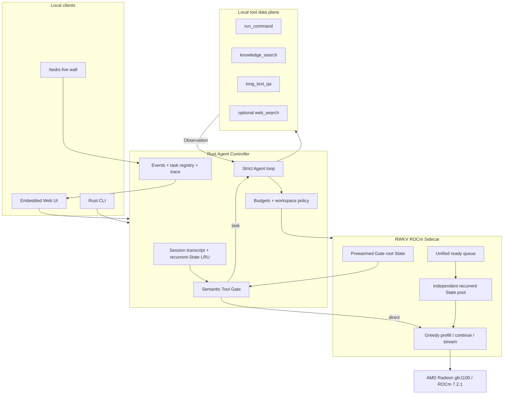

# RWKV State Agent — Project Specification

**Version:** 0.3.0-beta.2
**Date:** 25 August 2026

## 1. Executive summary

RWKV State Agent is a private, locally deployed general Agent that treats recurrent model state as a first-class runtime object. Unlike a stateless chat service that prepends and recomputes the full conversation on every turn, the system preserves each session's RWKV State and only evaluates newly appended content.

The same mechanism enables efficient independent work: many jobs retain isolated recurrent States while one scheduler batches ready rows on an AMD Radeon GPU. A strict Rust control plane supplies bounded Tool Calling, Action/Observation loops, state ownership, workspace isolation, streaming, metrics, and release guarantees.

The verified implementation runs RWKV-7 G1I Preview4922 13.3B locally on an AMD Radeon `gfx1100` GPU with ROCm 7.2.1. The demonstrated 100-job workload uses 100 independent prompts, owners, States, sessions, and workspaces with physical decode concurrency 32.

## 2. Target users and application scenarios

### 2.1 Private local assistant

A user can hold an ordinary multi-turn conversation without sending prompts or model State to a cloud model provider. The recurrent State retains the computed session context, while the transcript remains a recoverable local record.

### 2.2 Local software and office task execution

The user can request a bounded workspace task such as creating a small project, running tests, repairing a failure, or validating an artifact. The Agent performs one Tool Call per model turn, observes the result, and continues from the same owned State until verification succeeds or a budget terminates the task.

### 2.3 Local knowledge and long-document question answering

`knowledge_search` queries a separately configured local index. `long_text_qa` accepts pasted material, retrieves relevant passages, and returns evidence-grounded answers. These capabilities do not require Web retrieval.

### 2.4 Optional current-information research

When the user explicitly asks for current Web information, the semantic gate may select `web_search`. Retrieval is a tool rather than the product's central architecture. The Agent can fork several bounded research States and reduce their evidence back to an answer State.

### 2.5 High-throughput independent Agent jobs

The scheduler can retain many mutually isolated States and advance ready rows in batches. The demonstration workload generates and validates 100 independent website artifacts. This models a local multi-user or Subagent workload without pretending that unrelated users share one prompt State.

## 3. Product requirements

### 3.1 Functional requirements

1. Ordinary chat must not call a tool unnecessarily.
2. A session must reuse its recurrent State across turns.
3. The model must choose tools semantically rather than through keyword routing.
4. One model turn may emit one Tool Call or one final answer.
5. Tool results must return to the same owned State.
6. Each task must have bounded model tokens, tool steps, elapsed time, and output.
7. Independent jobs must not share context, workspace, or observations.
8. Tokens must stream through the real inference path.
9. State creation, use, release, errors, tools, timings, and artifacts must be auditable.
10. The Web UI and CLI must remain thin clients of one Rust Controller.

### 3.2 Non-functional requirements

- local-first operation;
- deterministic Greedy decode for protocol stability;
- no OOM at the frozen Radeon configuration;
- graceful failure isolation and State recovery;
- zero context crossover in the frozen benchmark;
- zero unreleased State after completed benchmark runs;
- loopback deployment by default;
- reproducible metrics with raw evidence and hashes.

## 4. System architecture



### 4.1 Component responsibilities

| Component | Responsibility |
|---|---|
| `crates/agent-core` | strict wire envelope, Tool registry, Agent loop, budgets, cancellation, events, State lifecycle |
| `crates/agent-runtime` | sessions, Sidecar client, recurrent chat cache, research, tools, workspace and sandbox policy |
| `crates/agent-server` | same-origin HTTP API, true NDJSON streaming, embedded Web UI, live task registry |
| `src/rwkv7_scheduler` | HF recurrent cache adaptation, batch gather/scatter, State pool, scheduler metrics |
| `src/rwkv_agent` | ROCm Sidecar, semantic gate prompts, continuous batch engine, persistent State registry, tool data plane |
| `web` | rendering only: conversation, Tool cards, State trace, runtime health, and `/tasks` |
| `benchmarks` | frozen State reuse, scaling, routing, and stability runners |
| `demos` | 100-independent-State end-to-end demonstration and live dashboard |

## 5. Agent state machine and protocol

### 5.1 One task

```text
READY
  → MODEL_ACTION
  → TOOL_EXECUTION
  → OBSERVATION
  → MODEL_ACTION
      → TOOL_EXECUTION
      → FINAL_ANSWER
  → VERIFY
  → DONE / FAILED
  → RELEASE
```

A model turn never emits multiple tools. Multi-step behavior is produced by continuing the same State after each compact observation. The runtime, not the model, enforces budgets and validates tool arguments.

### 5.2 Model-visible envelope

The strict model contract has only two valid outcomes:

```text
one Tool Call
or
one final Answer
```

Malformed envelopes receive one bounded repair attempt. Unknown tools, missing or extra arguments, invalid types, repeated side effects, State identity changes, and budget overruns are rejected by code.

### 5.3 Frozen tools

| Tool | Arguments | Runtime boundary |
|---|---|---|
| `run_command` | controlled command string | configured workspace, timeout, output cap, no unsafe sandbox fallback |
| `knowledge_search` | query | local knowledge endpoint |
| `long_text_qa` | question and captured text context | evidence selection and bounded answer |
| `web_search` | query | optional network data plane, only when semantically selected |

## 6. Memory and isolation model

### 6.1 Memory retained in this release

- local session transcript;
- RWKV recurrent State for active sessions.

Automatic cross-session personality extraction and silent long-term writes are intentionally disabled. This keeps the memory contract easy to audit and prevents unrelated sessions from being merged by heuristic rules.

### 6.2 State ownership

Every persistent State is bound to an Owner ID. Fork, continuation, classification, and release require the same Owner. Cross-owner access returns an error. Independent tasks use different owners and do not use shared Root Fork, except for explicit bounded research or the immutable semantic-gate root.

### 6.3 Workspace isolation

Agent tasks receive an explicit workspace. The verified AMD environment uses an unprivileged user, user/network namespaces, PRoot, a command timeout, bounded output, and no unsafe fallback. Workspace escape is rejected.

## 7. Model and local deployment plan

### 7.1 Model

| Property | Value |
|---|---|
| Architecture | RWKV-7 G1I |
| Checkpoint | Preview4922 13.3B |
| Parameters | 13,269,245,952 |
| Context | 12,288 tokens |
| Precision | FP16 |
| Decode policy | Greedy |
| Checkpoint SHA-256 | `af0378e1241823733f1f603469f92970b388fd42bb6f7f1b955e45bce2883772` |

The original checkpoint and converted weights are external assets and are not committed to GitHub.

### 7.2 AMD environment

| Property | Verified value |
|---|---|
| GPU architecture | `gfx1100` |
| Total VRAM | 51,522,830,336 bytes |
| Operating system | Ubuntu 24.04.4 |
| ROCm | 7.2.1 |
| PyTorch | 2.9.1 ROCm build |
| Rust | 1.97.1 |
| Scheduler State capacity | 132 |
| Persistent State capacity | 101 |
| Max physical batch | 32 |
| Prefill chunk | 32 |
| Batch window | 10 ms |

### 7.3 Local services

```text
18118  RWKV ROCm Sidecar
18121  Tool data plane
18120  Rust Controller + Web UI + /tasks
18122  read-only frozen 100-job review dashboard
```

The default services bind to loopback. Remote access should use SSH port forwarding or an authenticated private gateway.

## 8. AMD Radeon inference optimization

### 8.1 Recurrent chat continuation

The first turn prefills the system and user text into State `S1`. Later turns append only the prior assistant answer and the new user message:

```text
turn 1: System + User1                   → S1
turn 2: S1 + Assistant1 + User2          → S2
turn 3: S2 + Assistant2 + User3          → S3
```

This eliminates repeated computation of the full transcript. In a 16-turn frozen comparison, repeated-prefill input was 11,447 tokens while the State path processed 785 tokens. The measured speedup increased from 1.9922× at turn 2 to 12.5857× at turn 16 with identical outputs.

### 8.2 B1 recurrent cache zero-copy

A one-row decode already owns a correctly shaped cache. The previous generic gather/scatter path concatenated the row and selected it again, copying the full recurrent State twice per generated token. The B1 fast path passes the cache object directly and installs the returned cache directly. B1 temporary gather/scatter workspace is zero. Streamed and ordinary Greedy outputs remain identical.

### 8.3 Vectorized continuation prefill

Continuation chunks with existing recurrent cache can enter the native vectorized prefill path. A complete `[batch, chunk_length]` continuation is processed together instead of falling back to a token-by-token eager path.

### 8.4 Unified batching of independent States

The scheduler separates first-prompt rows from initialized continuation rows, forms bounded physical batches, and advances independent cache rows together. The frozen optimal physical batch is 32. Larger resident counts are completed in waves while retaining each task's State on GPU.

### 8.5 Prewarmed semantic routing State

The static semantic gate instruction and examples are prefetched once during Sidecar startup. A request forks this immutable root, appends dynamic context and the current user text, scores the fixed `tool` and `chat` labels, and releases the child. This avoids keyword routing and repeated static prefill.

### 8.6 Direct-chat answer envelope and token budget

Ordinary chat has a 96-token maximum and uses an explicit visible-answer envelope with `</answer>` as the leading stop. This prevents long hidden continuations and sharply reduces latency for short responses.

### 8.7 True streaming

After each Greedy state update, the Python engine emits a delta. The Sidecar exposes NDJSON, the Rust client consumes it incrementally, the Controller forwards phase/delta/final events, and the Web UI renders the current model text. A disconnected UI does not interrupt recurrent State mutation.

## 9. Evaluation plan and verified results

### 9.1 Benchmark A — cross-turn State reuse

Arm A recomputes System plus the full transcript every turn. Arm B preserves recurrent State and appends only new text. Inputs, model, Greedy policy, stops, and output budget are frozen.

| Turn depth | Measured State-path speedup |
|---:|---:|
| 2 | 1.9922× |
| 4 | 3.7837× |
| 8 | 6.9857× |
| 16 | 12.5857× |

All 16 output comparisons were exact.

### 9.2 Benchmark B — independent State scaling

| Resident States | Physical batch | Aggregate tok/s |
|---:|---:|---:|
| 1 | 1 | 1.6661 |
| 4 | 4 | 6.2571 |
| 8 | 8 | 11.6955 |
| 16 | 16 | 19.7453 |
| 32 | 32 | 29.9838 |
| 64 | 32 | 25.7295 |
| 100 | 32 | 24.0266 |

The B32 serial arm took 58.570 seconds and the concurrent arm took 5.536 seconds, a 10.5792× speedup. B32 decode GPU Busy averaged 88% and peaked at 98%; peak VRAM was 37,871,226,880 bytes. The 32 Greedy outputs matched exactly.

A Gate 5 same-protocol warm regression produced 166 tokens at 29.3472 tok/s, 2.123% below the frozen 29.9838 tok/s reference and inside the 5% acceptance envelope.

### 9.3 Benchmark C — 100 independent Agent jobs

The final run completed 100/100 website tasks in 631.985 seconds. It used 100 independent prompts, sessions, owners, and workspaces, with 100 initially resident States and physical decode concurrency 32.

| Metric | Result |
|---|---:|
| Valid artifacts | 100/100 |
| Final failures | 0 |
| Protocol leakage | 0 |
| Context crossover | 0 |
| Prebuilt answers | 0 |
| Average GPU Busy | 86.205% |
| Peak GPU Busy | 99% |
| Peak VRAM | 48,093,364,224 bytes |
| Maximum active decode rows | 32 |
| Final unreleased State | 0 |

One first-attempt worker emitted an incomplete envelope. The runtime released it, created a new recovery State, and completed the task. This failure and recovery are retained in the trace.

### 9.4 Semantic routing

The 40-case semantic gate set scored 38/40 (95%). All factual/current/local/pasted-text and context-follow-up Tool requests routed correctly, with zero missed Tool requests. Two ordinary requests were false Tool routes. No keyword router was added to hide these failures.

### 9.5 Gate 5 ordinary chat and streaming

| Metric | Result |
|---|---:|
| First-turn TTFT / wall | 7.812 / 8.240 s |
| Second-turn TTFT / wall | 6.602 / 7.028 s |
| Old first / second wall | 63.648 / 63.784 s |
| First / second speedup | 7.72× / 9.08× |
| Second-turn recurrent State reused | yes |
| Real Controller deltas | 6 |
| Stream / non-stream answer parity | exact |

## 10. Evidence and auditability

Each frozen benchmark retains:

- exact input and SHA-256;
- model, tokenizer, source, and runner hashes;
- complete command and configuration;
- raw per-case JSONL;
- aggregate metrics JSON;
- GPU/VRAM time series;
- failure traces;
- artifact manifests and SHA256SUMS;
- State release snapshots.

Reviewed benchmark summaries and screenshots are stored under `evidence/`. Raw traces, private prompts, machine configuration, and large model assets remain outside the repository. Deployments can override `EVIDENCE_ROOT`.

## 11. User interfaces

### 11.1 Web UI

The Rust server embeds a Claude Code/Codex-inspired local UI. It provides:

- real token streaming;
- visible Tool cards and observations;
- State cached/reused/released status;
- model, backend, sandbox, and endpoint health;
- isolated new sessions;
- a live `/tasks` wall backed by the same Controller.

### 11.2 CLI

The Rust CLI connects to the same Controller. It supports ordinary chat, direct tools, bounded state-parallel research, status inspection, JSON output, and named isolated sessions.

## 12. Privacy, security, and failure boundaries

- No cloud language model is required for the core Agent path.
- Prompts, transcript, recurrent State, workspaces, and artifacts remain local.
- Optional Web Search is clearly separated from the local execution path.
- The Controller is not a public authenticated service and binds to loopback by default.
- Workspace command execution is disabled unless explicitly configured.
- Owner isolation protects persistent State operations.
- State capacity, queue capacity, token count, tool count, elapsed time, command output, and task history are bounded.
- Worker failure is isolated; completed and unrelated jobs continue.
- The task wall is an in-memory operational view of the latest 100 runs, not a persistent task database.

## 13. Limitations and non-claims

1. The Radeon runtime is the HF native recurrent PyTorch backend. The NVIDIA Albatross MMA extension was tested, failed on ROCm-specific incompatibilities, and is not claimed as ported.
2. The demonstrated model is FP16 and requires a high-memory Radeon configuration for 100 resident States.
3. The semantic gate still has two known false Tool routes in its 40-case set.
4. Public authentication, TLS termination, distributed multi-host scheduling, automatic cross-session personal memory, and model weight distribution are outside this release.
5. “100 independent tasks · physical concurrency 32” is the only approved concurrency claim.

## 14. Reproduction outline

1. Install ROCm 7.2.1 and the matching PyTorch build.
2. Create the Python environment and install `.[realtime,agent,dev]`.
3. Obtain Preview4922 13.3B and convert it with the verified RWKV HF adapter revision.
4. Export the Sidecar variables listed in the root README.
5. Build the Rust workspace in release mode.
6. Start Sidecar `18118`, data plane `18121`, and Controller `18120`.
7. Open `/`, `/tasks`, and `/health`.
8. Run `bash scripts/verify_release.sh`.
9. Run frozen AMD benchmarks when their required model and evidence paths are available.

## 15. Deliverables

- complete Rust and Python source;
- embedded Web UI and Rust CLI;
- AMD ROCm Sidecar configuration;
- strict Tool protocol and Agent loop;
- local knowledge and long-text capabilities;
- State reuse, scaling, routing, streaming, and stability benchmarks;
- 100-independent-State demonstration, artifacts, metrics, and trace;
- English README and this Project Specification;
- reviewed benchmark evidence bundles;
- release verification script.
