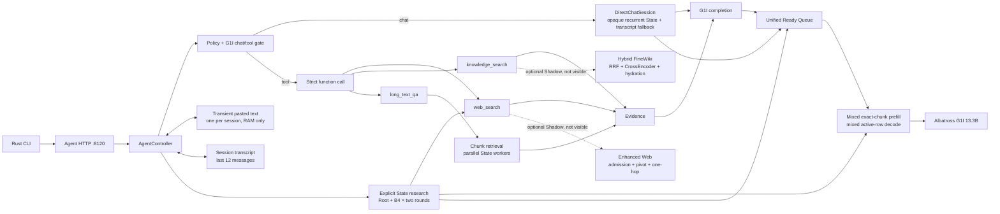

# RWKV Agent

Unified Agent benchmark schemas, track-specific metrics, and frozen paired
comparison are documented in `docs/AGENT_BENCHMARK.md`.

Clean desktop workspace for the current RWKV Agent implementation.

**Status:** the scheme-B Albatross state scheduler is integrated into the G1I
Sidecar through a continuous batching worker. The public Beta topology is one
loopback Sidecar on port 8118 and one loopback Controller on port 8120. The
Legacy Web frontend remains a separate preview surface.

The FineWiki Hybrid retriever is also integrated as an opt-in, bounded Shadow
behind `knowledge_search`. It preserves the existing visible `K1..K5` lexical
result and asynchronously compares Lexical + Dense RRF + CrossEncoder +
page-restricted passage hydration. It is disabled by default and has not been
enabled on 8120.

Realtime Web Enhanced retrieval is integrated the same way behind
`web_search`: the visible `W1..W5` evidence remains Legacy while a private,
bounded Shadow records Enhanced candidates, fetches, results, warnings and
latency. It is also disabled by default and has not been deployed to 8120.
The Shadow code is present in the deployed release, but remains disabled.

State-native Web research is exposed only through the explicit
`POST /v1/agent/run_stateful` endpoint and the Rust CLI `research` or
interactive `/research` command. It passed the real G1I 7.2B Root/Fork/Resume
equivalence and two-round strict Tool Call gates. Ordinary messages still use
`/v1/agent/run`, and `/web` remains a direct one-shot tool call.

## Current CLI backend

The installed lifecycle script starts a user-configured local CUDA backend. It
contains no built-in remote server, account, model path or tunnel:

```text
rwkv
  -> 127.0.0.1:8120 (Agent Controller)
  -> 127.0.0.1:8118 (single-GPU RWKV 13.3B Sidecar)
```

`rwkv-agent-service stop` only stops PIDs recorded under the configured local
state directory. Remote users run the service on the GPU host and provide their
own SSH tunnel or authenticated gateway.

```bash
rwkv-agent-service start
rwkv-agent-service status
rwkv doctor
rwkv research --branches 4 --rounds 2 "your question"
rwkv-agent-service stop
```

The default model is `rwkv7-g1i-preview4922-13.3b` with a 12,288-token context
on one V100. Discovery providers default to GitHub, MediaWiki and Crossref,
with Bing as the bounded fallback. Tavily is prepended when
`TAVILY_API_KEY` is present at service start. Paths, ports, model ID and
provider order can be overridden through the `RWKV_AGENT_*` environment
variables documented in `cli/scripts/rwkv-agent-service`.

## Architecture



The Python implementation follows the same boundaries:

- `controller.py` assembles dependencies and owns only request orchestration;
- `tool_routing.py`, `tool_protocol.py` and `tool_executor.py` separate the
  semantic gate, strict Function Call wire format and adapter dispatch;
- `chat_session.py`, `chat_state.py` and `chat_prompts.py` separate opaque
  recurrent-State lifecycle, bounded ownership/cache and prompt rendering;
- `state_agent.py` orchestrates bounded research while `state_prompts.py`,
  `state_evidence.py` and `state_answer.py` own protocol text, Evidence
  selection and citation/claim validation;
- `persistent_state.py` owns persistent State identity, owner, TTL and capacity;
  `state_runtime.py` owns only inference operations against that registry, and
  `state_batching.py` contains the immutable continuation-row contract;
- `batching.py` owns the single bounded Ready Queue used by ordinary
  Completion, Gate and persistent-State Continuation rows;
- `rwkv_runtime` contains framework-neutral greedy token, decoded Stop,
  classification and scheduler interface contracts shared by continuous and
  persistent serving.

## Clean workspace layout

```text
src/rwkv_agent/            Agent Controller, HTTP, Sidecar, batching and tools
src/rwkv_runtime/          Framework-neutral decode/classification contracts
src/rwkv7_scheduler/       State slab and exact chunk/decode scheduler
src/rwkv_search/           Internal realtime and FineWiki dependencies
cli/                       Claude-style Rust terminal client
tests/                     Current unit and scheduler tests
benchmarks/                Current reproducible performance runners/results
deploy/                    Local Agent and optional SearXNG examples
configs/                   Retrieval configuration
docs/                      Architecture and scheduler notes
archive/                   Historical Agent experiments, outside active path
var/                       Runtime-only files; ignored and not committed
```

The old `experiments/agent_mvp` runtime and standalone scheduler package are no
longer duplicated in the active path. Historical experiments remain under
`archive/` for reference.

## Active functions and state machine

The model sees exactly three functions:

```text
web_search(query)
knowledge_search(query)
long_text_qa(question)
```

The deployed/default `/v1/agent/run` path permits at most one external function
call:

1. policy fast path or G1I single-token `chat/tool` gate;
2. direct answer, or one strict `<tool_call>`;
3. bounded tool execution and Evidence;
4. final answer;
5. append the exchange to the session transcript.

Visible model output passes through a narrow reasoning-boundary normalizer:
only complete leading `<think>...</think>` blocks are hidden. Tool output is
then checked by the unchanged full-envelope JSON/schema/tool allowlist parser;
ordinary prefixes, incomplete reasoning blocks and trailing commentary remain
invalid. The raw completion is retained in the private trace, while only the
visible answer is returned and stored in session history. Historical turns are
normalized again when rendered, so an older leaked block cannot poison a later
Tool Call.

Long-term extracted memory remains disabled. Only the latest 12 messages from
the current session are supplied to answer generation.

An additional **explicit, opt-in** State-native path is available at
`/v1/agent/run_stateful`. It prefills one root RWKV state, forks up
to four GPU-resident branch states, runs one `web_search` per branch for one to
three rounds, resumes every branch with its own Tool Result, deduplicates
Evidence and resumes the retained root for the final answer. It does not merge
state tensors. The equivalent CLI entry points are `rwkv research ...`
and interactive `/research ...`. See `docs/STATE_NATIVE_AGENT.md`.

`long_text_qa` is the general part borrowed from the Three Body batch-QA
experiment, without its task IDs, gold positive rules or question-specific
extractors:

1. split a UTF-8 document into bounded overlapping chunks;
2. retrieve the top chunks with query-feature IDF;
3. submit each selected chunk as an independent G1I recurrent-state job;
4. require a short candidate/null and an exact quote;
5. recover grounded fragments from imperfect greedy JSON without inventing text;
6. deterministically reduce candidates into ranked `L#` Evidence;
7. pass the top answer hint and its Evidence ID to the normal final-answer stage.

The user pastes long text directly as a chat turn. At 4,000 characters or more,
the Controller captures it without model inference, keeps one text per session
in a bounded RAM-only buffer, and writes only a short placeholder to the normal
SQLite transcript. The next question is routed with
`Active pasted long text: yes`; the model emits only the question and the tool
obtains the source internally. Pasting a new long text replaces the previous
one in that session.

Defaults are Top-16 chunks, eight workers, 1,200 characters per chunk, 160
characters overlap, eight Evidence items, one million characters per pasted
text and at most 32 buffered sessions.

## Unified batching integration

`src/rwkv_agent/sidecar.py` owns one:

- `AlbatrossStatePool`;
- `AlbatrossChunkScheduler`;
- one `ContinuousBatchEngine` unified Ready Queue worker.

Concurrent Completion, Gate, single-State chat continuation and multi-row Agent
branch continuation requests enter the same bounded queue. The worker:

1. admits jobs into generation-protected state slots;
2. installs persistent continuations without running a separate blocking
   prefill loop;
3. advances ephemeral prompts and persistent continuations by one exact
   64-token quantum per round;
4. groups only equal-length tails and never pads RWKV state;
5. greedily samples all ready ephemeral and persistent rows together;
6. commits terminal stop/budget tokens only for persistent rows, preserving the
   recurrent continuation boundary;
7. releases ephemeral state immediately on EOS, stop, limit, cancellation or
   error, while persistent state remains owned by its registry.

Initial persistent-State creation, fork and persistent classification retain
their lifecycle APIs and do not yet enter this queue. The unified worker removes
the former second persistent-State decode thread; one queue capacity and one
backpressure policy now cover all user-visible generation paths.

Default environment configuration:

| Variable | Default |
|---|---:|
| `G1I_STATE_CAPACITY` | 32 |
| `G1I_MAX_BATCH_SIZE` | 8 |
| `G1I_PREFILL_CHUNK_SIZE` | 64 |
| `G1I_BATCH_WINDOW_MS` | 4 |
| `G1I_MAX_WAITING_JOBS` | 256 |
| `G1I_REQUEST_TIMEOUT_SECONDS` | 170 |
| `G1I_CONTEXT` | 12288 |
| `G1I_PERSISTENT_STATE_CAPACITY` | 8 |
| `G1I_PERSISTENT_STATE_TTL_SECONDS` | 120 |

The HTTP `/health` response exposes queue, active prefill/decode, scheduler shape
counts, state-pool allocation and workspace memory.

## Real integrated smoke

V100, G1I preview3260 7.2B, eight natural Chinese/English prompts, eight greedy
output tokens:

| Mode | Wall time |
|---|---:|
| Sequential through integrated Sidecar | 4.776 s |
| 8 concurrent requests | 1.942 s |
| Speedup | **2.460×** |

All 8 concurrent outputs were byte/token exact against sequential execution.
Both digests are:

`6e5d5a7d68cb1daeaa5bf67884974bafb083a3f25c9d1af8d4350cba8b09eda2`

Raw result:
`benchmarks/scheduler/sidecar_batch_smoke_v1.json`.

The larger scheduler matrix remains at
`benchmarks/scheduler/g1i_production_matrix_final.json` and covers B8 prompt
lengths through 6,144 tokens.

## Greedy Tool Call and pasted-text smoke

The question-only three-function protocol was compared on the real G1I 7.2B
greedy runtime with 30 Chinese/English cases: 12 active-pasted-text
`long_text_qa`, nine `web_search` and nine `knowledge_search`.

| Template | Strict + correct |
|---|---:|
| Production compact protocol + three examples | **30/30** |
| Compact signatures + three examples | **30/30** |
| `System: {json}` + three examples | **30/30** |

The two finalists were repeated twice: both were 60/60 and byte-exact
on all 30 repeated cases. Production keeps the lowest-latency compact protocol.
Every successful long-text call contained only `{"question": ...}`. Raw
matrices are `benchmarks/greedy_tool_call_template_matrix_v1.json` and
`benchmarks/greedy_tool_call_repeat_v1.json`.

On the supplied 558,654-byte `三体1.txt`, six fixed questions used generic
Top-8 retrieval with no gold data at runtime:

- the answer-bearing text was present in ranked Top-1 Evidence for 6/6;
- serial and eight-worker Evidence were byte-identical;
- serial/eight-worker wall time was 68.254/34.138 seconds, a **1.999×** speedup.

The isolated full Agent path accepted the 189,093-character text without model
inference, then greedily emitted a strict question-only `long_text_qa` call,
ran 16 chunk workers at concurrency eight, and answered
`红岸工程第147次常规发射 [L1]` in 14.597 seconds. Results are
`benchmarks/long_text_qa_smoke_v1.json` and
`benchmarks/long_text_agent_e2e_v1.json`.

## Install and test

```bash
python -m venv .venv
source .venv/bin/activate
pip install -e '.[realtime,analysis,agent]'

PYTHONPATH=src python -m unittest discover -s tests -v
ruff check src tests benchmarks

cd cli
cargo fmt --check
cargo test
cargo clippy --all-targets -- -D warnings
```

Explicit research examples:

```bash
rwkv research "Who created RWKV and who maintains it?"
rwkv
# then: /research Who created RWKV and who maintains it?
```

## Hybrid knowledge Shadow

Enable only in an isolated Agent process:

```bash
export RWKV_AGENT_KNOWLEDGE_SHADOW=1
export RWKV_AGENT_EMBEDDING_MODEL=/path/to/multilingual-e5-small
export RWKV_AGENT_RERANKER_MODEL=/path/to/bge-reranker-v2-m3
export RWKV_AGENT_RETRIEVAL_DEVICE=cuda:0
export RWKV_AGENT_KNOWLEDGE_SHADOW_LOG=var/knowledge-shadow.jsonl
```

The visible tool result always remains Legacy. The worker has one thread, an
eight-request bounded queue, lazy model loading, per-stage latency telemetry,
page-order comparison, full Hybrid trace logging, and exception-to-Legacy
fallback. A full queue drops only the Shadow task and never blocks the chat
request.

The frozen 24-case V100 comparison is
`benchmarks/knowledge_hybrid_shadow_v1.json`: overall Hit@5 changed from
18/24 to 21/24, with 0 Hybrid failures. Hit@1 stayed 15/24 and English Hit@5
stayed 9/12, while mean latency increased from 851.9 ms to 1704.8 ms.
Consequently the integration is validated, but Hybrid is not approved as the
default retrieval arm.

## Realtime Web Shadow

Enable only in an isolated Agent process:

```bash
export RWKV_AGENT_WEB_SHADOW=1
export RWKV_AGENT_WEB_SHADOW_SAMPLE_RATE=0.10
export RWKV_AGENT_WEB_SHADOW_MAX_PENDING=2
export RWKV_AGENT_WEB_SHADOW_LOG_MODE=metrics
export RWKV_AGENT_WEB_SHADOW_LOG=var/web-shadow-metrics.jsonl
```

The visible tool result always remains the Legacy `W1..W5` evidence. The
production default samples 10% of eligible Web calls before queue admission,
writes only aggregate metrics, and never logs raw queries, URLs, page bodies,
or full traces. The Shadow has one worker and at most two pending requests. Queue saturation,
timeouts, discovery/fetch errors and trace-write failures drop or degrade only
the Shadow arm. A healthy local SearXNG configured by `configs/default.json`
is preferred; otherwise the current Bing HTML discovery fallback is used.
See `docs/PRODUCTION_WEB_SHADOW.md` for preflight, observation, promotion, and
rollback procedures. Full trace mode is reserved for isolated benchmarks.

The frozen 50-case V100 comparison is `benchmarks/web_shadow_v1.json`.
Enhanced reduced garbage results from 17.56% to 1.08%, but Candidate Domain
Recall@10 fell from 32% to 26%, non-empty results fell from 86% to 58%, and
fetch success fell from 72.99% to 58.77%. The integration/failure-isolation
gate passed, but Enhanced is not approved as the default Web arm. The run used
Bing HTML fallback because local SearXNG was unavailable, so it is not a
SearXNG engine-quality result.

The follow-up 5H repair is frozen in `benchmarks/web_recall_5h_v1.json`.
Generic subject-first English query compaction, recall-protected Top-10
reranking, a process-shared discovery cache, stage failure attribution and an
auditable empty-Evidence fallback raised Candidate Domain Recall@10 from 30%
to 50%, result Domain Recall@10 from 24% to 40%, and non-empty fetched results
from 72% to 88%, while reducing garbage from 9.15% to 1.12%. Paired wins were
10-0, 8-0 and 8-0 respectively. The isolated public SearXNG engines did not
remain healthy under sustained load, so the accepted run used the existing
Bing HTML fallback and does not claim durable multi-engine operation. Visible
Legacy output remains unchanged.

## Run locally on a CUDA host

```bash
rwkv-agent-service doctor
rwkv-agent-service start
rwkv doctor
```

The Sidecar requires the external G1I weights, Albatross `faster3a_2607`, CUDA,
PyTorch and the RWKV tokenizer pipeline. Those large dependencies are not copied
into this workspace.

## Remaining boundaries

- the supported Beta services are localhost-only and require an authenticated
  gateway before public exposure;
- persistent HTTP states are turn-scoped, owner-isolated, capped at eight per
  Sidecar and expire after 120 seconds; there is no CPU state offload;
- no multi-GPU state spanning—each request stays within one Sidecar;
- the default Agent still performs at most one external function call per
  turn; only explicit State research runs B1-B4 for one to three rounds;
- State research uses fixed bounded rounds and semantic Evidence reduction;
  it has no evidence-sufficiency adaptive early stop or tensor-state merge;
- pasted text is transient process memory and is lost on restart; there is no
  file-path, upload, attachment, PDF or Office ingestion surface;
- citation obedience and long-text answer quality remain model-quality work.
